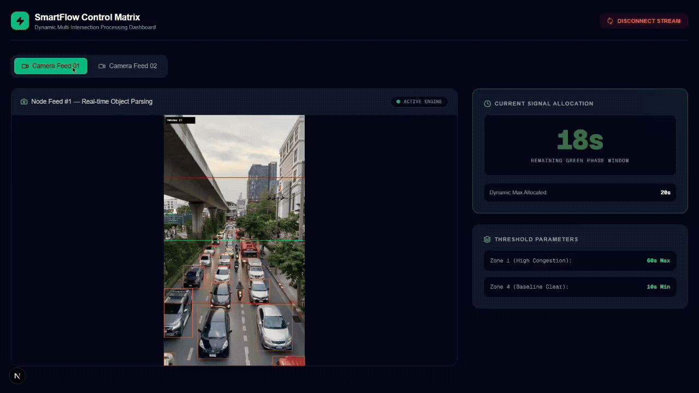

# SmartFlow: Computer Vision Adaptive Traffic Control System

An intelligent, decoupled multi-camera edge computing solution that analyzes real-time vehicle queue lengths to dynamically calculate optimal traffic signal clearing windows.



> 🔄 **Project Evolution Note:** This platform represents a total architectural modernization of a traffic tracking prototype I built a few years ago. The system was refactored from a legacy, single-threaded desktop script into a high-performance, asynchronous full-stack web ecosystem utilizing modern decoupled paradigms.

---

## 🏗️ The Architectural Overhaul Matrix

| Engineering Dimension | Legacy Prototype | Modern Upgraded Architecture |
| :--- | :--- | :--- |
| **Detection Core** | YOLOv8 | **YOLOv11 Nano Engine** (Higher Tracking Precision & Lower Latency) |
| **System Execution** | Monolithic Loop (`cv2.imshow`) | **Asynchronous REST API + Multipart JPEG Streaming** |
| **Backend Layer** | Local Python Script | **FastAPI Asynchronous Web Server + Uvicorn ASGI** |
| **User Interface** | Standard Desktop GUI Canvas | **Next.js 14 Web Dashboard + Tailwind CSS Layouts** |
| **Feed Capabilities** | Single Video Execution Loop | **Dynamic Multi-Intersection Tabbed Channel Routers** |
| **Asset Strategy** | Local Storage Dependent | **Cloud-Decoupled Content Streaming (Cloudinary CDN)** |

---

## 🛠️ Technology Stack

*   **Frontend Dashboard:** Next.js 14 (App Router), React, Tailwind CSS, Lucide Icons
*   **AI Inference Engine:** FastAPI, Python 3.10, Ultralytics YOLOv11, OpenCV Core Pipeline
*   **Media Hosting Infrastructure:** Cloudinary Cloud Storage CDN

---

## 🌐 Live Deployment & Production Context

*   **Web User Interface:** Hosted on Vercel
*   **Vision Pipeline Core:** Hosted on Render (Docker Linux Container Layer)

### 💡 Infrastructure & Performance Engineering Note
Because this public portfolio instance operates entirely on **free-tier shared CPU cloud instances**, you may experience processing frame latency when switching camera video streams. 

In a standard commercial deployment, this architecture is designed to execute directly on dedicated **Edge Compute Hardware (e.g., NVIDIA Jetson modules)** mounted alongside traffic cameras, or on **GPU-accelerated cloud nodes (such as AWS EC2 G5 instances)** to maintain fluid, real-time 30+ FPS pipelines. The high-speed capabilities of the local code can be observed in the smooth demo presentation asset at the top of this document.

---

## 📦 Directory Architecture

```text
Smart-Traffic-Management-System/
├── assets/
│   └── dashboard-demo.gif      # Smooth local recording visual presentation
├── backend/
│   ├── app.py                  # FastAPI server & YOLOv11 logic processing engine
│   ├── requirements.txt        # Python backend framework constraints
│   └── Dockerfile              # Container building schema for cloud drivers
└── frontend/
    ├── package.json            # Node dependency configurations
    └── src/
        └── app/
            └── page.tsx        # Multi-feed responsive client telemetry canvas
